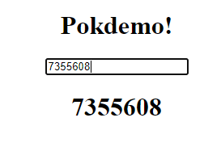
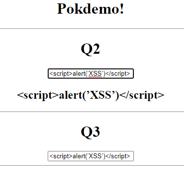
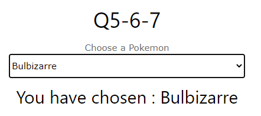
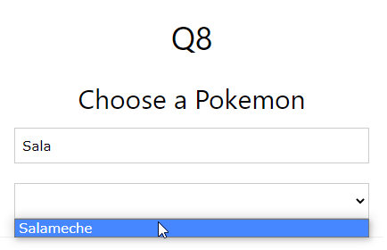
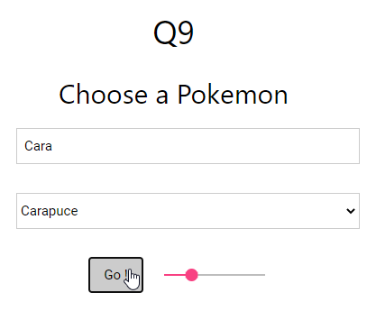
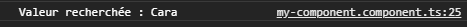
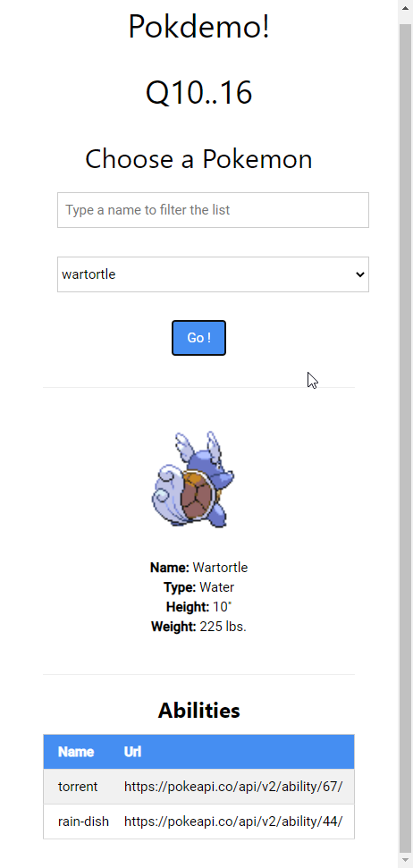

## Q2

La valeur sous l'input est mise à jour en même temps que celui-ci :



## Q3bis

Lorsqu'on écrit du html dans les inputs liés, il n'est pas interprété :



## Q5

```typescript
listPokemon = [new Pokemon("Bulbizarre"), new Pokemon("Salameche"), new Pokemon("Carapuce"), new Pokemon("Pikachu")]
```

## Q6-7



## Q8



## Q9





##### BIS

Il y a un nombre très important de modules dans `node_modules` 

## Q10..16

